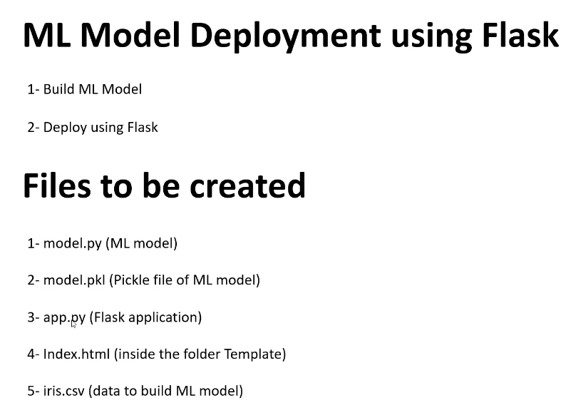

'''
Data Scientist Jr.: Dr.Eddy Giusepe Chirinos Isidro
'''

# ML Model Deployment using Flask
Neste Script aprenderemos a desenvolver um modelo de aprendizado de máquina
e como implantá-lo usando o `Flask`. 

Este estudo está baseado no seguinte vídeo:

* [ML Model Deployment using Flask](https://www.youtube.com/watch?v=MxJnR1DMmsY)

Vamos a seguir os seguintes passos para nosso modelo de Machine Learnig:

